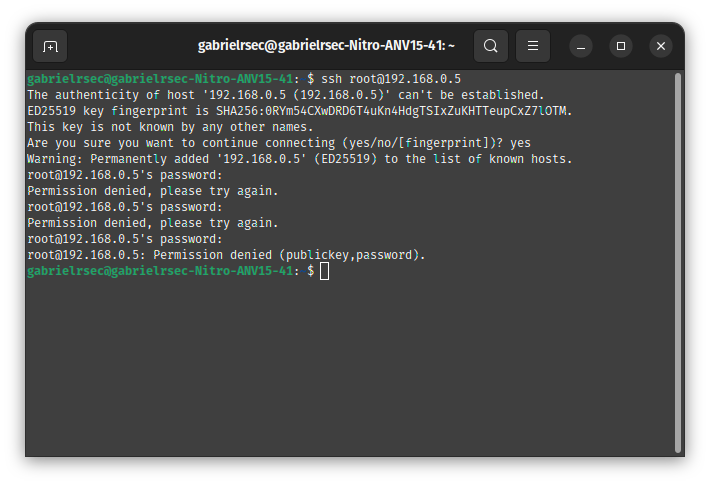

# 🐧 Linux Lab & Networking Fundamentals

Este repositório documenta a construção de um ambiente de laboratório focado em Rocky Linux 9, aplicando conceitos de Engenharia de Software e Arquitetura de Redes.

## 🛠️ Stack Tecnológica
- **SO:** Rocky Linux 9 (Guest) | Ubuntu/Linux (Host)
- **Virtualização:** Oracle VM VirtualBox
- **Protocolos:** TCP/IP, SSH, ICMP

## 🌐 Arquitetura de Redes e Conectividade
O maior desafio deste laboratório foi estabelecer a comunicação entre o Host e a VM. Apliquei os seguintes passos:

1. **Configuração de Camada 2:** Transição da interface para **Modo Bridge**, permitindo visibilidade na sub-rede local.
2. **Mapeamento de Interfaces:** Identificação das diferenças entre interfaces físicas de rede. No host, validei a interface wireless (`wlp3s0`) via `nmcli`, enquanto na VM (Guest), mapeei a interface virtual ethernet (`enp0s3`) via `ip addr`.
3. **Troubleshooting SSH:** Resolução de falhas de permissão e autenticação para acesso remoto seguro após a validação do endereçamento IP correto.

## 💻 Administração do Sistema (Terminal)
Prática de gestão de arquivos e permissões de superusuário (`sudo` / `root`):
- Criação e movimentação de diretórios (`mkdir`, `mkdir -p`, `cp -r`).
- Gestão de repositórios e manutenção preventiva.

## 📸 Galeria Técnica

Configuração da interface de rede em modo Bridge para que a VM opere como um nó real na rede local.

* **SO e Arquitetura:** Rocky Linux 9 configurado como Red Hat (64-bit).
* **Hardware Virtual:** Alocação de 4GB de RAM e 3 CPUs para alta performance.
* **Interface de Rede:** Bridge habilitado na interface `wlp3s0` (Wi-Fi Host), permitindo a obtenção de IP externo e conectividade SSH.

*Prova de configuração da interface física em modo Bridge no VirtualBox.*

### 2. Diagnóstico de Interfaces do Host (Wireless)

*Uso do nmcli para mapear a interface wireless (wlp3s0) do host Nitro.*

### 3. Validação de IP na VM (Ethernet Virtual)

*Comando ip addr confirmando o endereçamento IPv4 na interface ethernet virtual enp0s3.*

### 4. Manipulação de Arquivos e Diretórios

*Demonstração de comandos administrativos e navegação no sistema de arquivos.*

### 5. Troubleshooting de Segurança (SSH)

*Análise de falha de permissão de acesso ao serviço SSH.*

### 🛡️ Manutenção de Sistema & Kernel
Além da rede, realizei intervenções críticas no sistema operacional host para viabilizar o ambiente:
- **Resolução de Conflitos APT:** Tratamento de erro de repositórios conflitantes via terminal, utilizando `sudo rm` e limpeza de cache para desbloquear o gerenciador de pacotes.
- **Aceleração de Hardware:** Diagnóstico de erros de extensão AMD-V/KVM, compreendendo a interação entre o hypervisor e o hardware físico.
