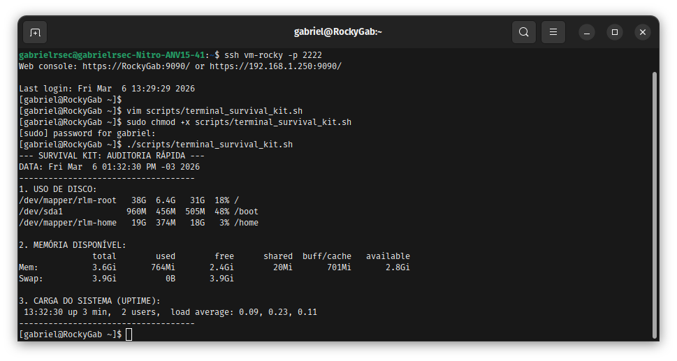
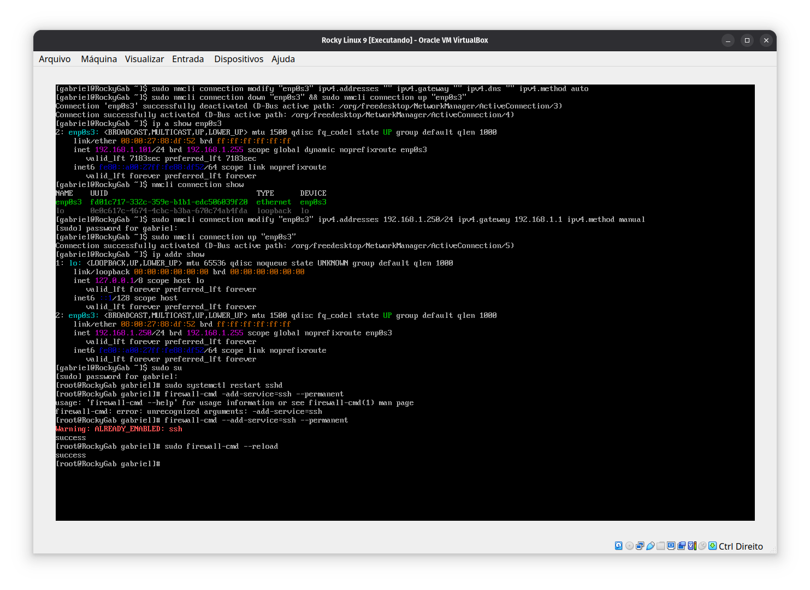
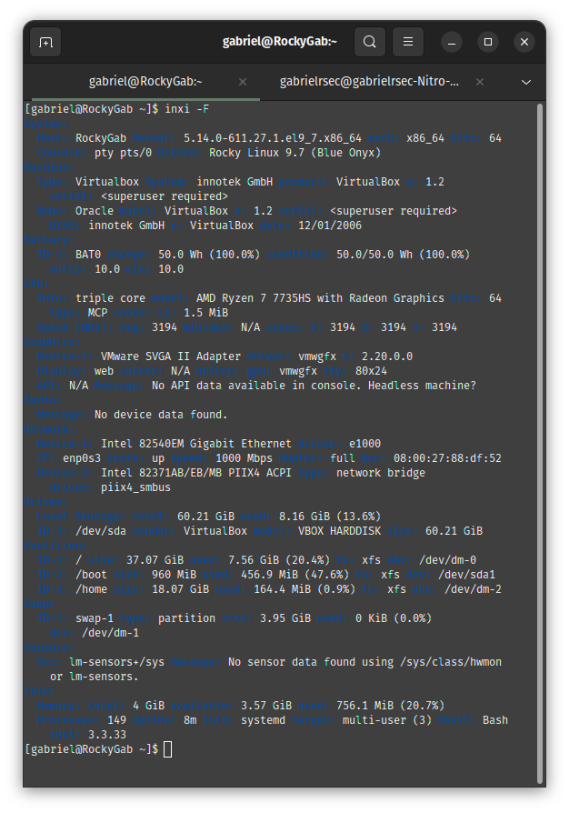
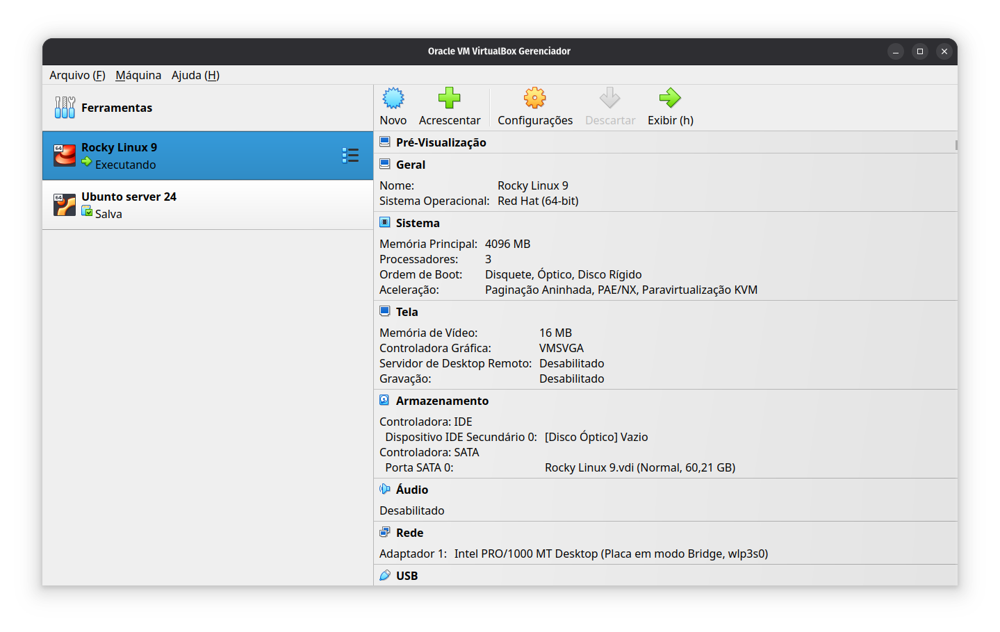

# Repo 1: Linux Lab - Foundations & Git Mastery 🐧

> Provisão de infraestrutura base, automação de diagnóstico e governança de código profissional.

| Categoria | Tecnologias | Status |
| :--- | :--- | :--- |
| **S.O.** | Ubuntu Server / Rocky Linux | ✅ CLI-only |
| **Scripts** | Bash (Auditoria de Saúde) | ✅ Funcional |
| **Rede** | IPv4 Estático / DNS Resiliente | ✅ Validado |
| **Versionamento** | Git Flow & Troubleshooting | ✅ Padronizado |

---

## 🎯 Objetivo Técnico
Estabelecer o alicerce de uma operação de TI moderna, focando em minimalismo operacional, resolução de falhas de conectividade de baixo nível e governança rigorosa via Git. Competências fundamentais para SRE e Arquitetura Cloud.

---

## 📁 1. Automação de Saúde (Terminal Survival Kit)

### Contexto do Problema
Servidores *Headless* (sem interface gráfica) necessitam de mecanismos rápidos e leves para auditoria de recursos (CPU, Memória, Disco) sem depender de ferramentas externas pesadas.

### Troubleshooting e Resolução
* **Solução Aplicada:** Desenvolvimento do script `scripts/terminal_survival_kit.sh` em Bash puro para varredura de gargalos e dump de diagnóstico em tempo real.

### Evidência Técnica

  
📂 Clique para ver a Auditoria de Saúde do Terminal

  

---

## 📁 2. Persistência de Rede e DNS Fix

### Contexto do Problema
Falha intermitente de resolução de nomes (DNS) e perda de rota padrão após reinicialização da máquina virtual, impedindo o download de pacotes e atualizações críticas do sistema.

### Troubleshooting e Resolução
* **Causa Raiz:** Conflito de concessão do DHCP dinâmico no ambiente de laboratório virtualizado.
* **Solução Aplicada:** Transição de DHCP para endereçamento IPv4 estático persistente e configuração de DNS autoritativos resilientes diretamente nos arquivos de rede.

### Evidência Técnica

  
📂 Clique para ver a Validação de DNS e IP Estático

  * **Validação de DNS Resolvido:** 
  * **Configuração de IP Estático:** 

---

## 📁 3. Governança com Git Mastery

### Contexto do Problema
Garantir a integridade do código dos scripts e evitar corrupção de ramificações (branches) durante o desenvolvimento colaborativo de infraestrutura (IaC).

### Troubleshooting e Resolução
* **Solução Aplicada:** Domínio em fluxos de trabalho do Git, gestão de histórico de commits, restauração de arquivos e resolução limpa de conflitos de merge no terminal.

### Evidência Técnica

  
📂 Clique para ver a Governança e Gestão do Git

  

---

## 🛡️ Diferenciais de Operação (SRE Mindset)

### Minimalismo Operacional (Tuning de Boot)
Otimização do consumo de RAM do servidor desativando o subsistema gráfico X11.
* **Solução:** Utilização do `multi-user.target` do Systemd para operação puramente via texto.

### Monitoramento de Hardware e Hardening Inicial
Uso de utilitários nativos (`inxi`, `top`, `ss`) para validação de integridade e migração da porta SSH padrão (`22`) para a porta `2222` para mitigar ataques de varredura.

### Evidência Técnica

  
📂 Clique para ver o Hardening de SSH e Monitoramento de Hardware

  * **Systemd Target CLI:** 
  * **Auditoria de Hardware (inxi):** 
  * **Painel de Infraestrutura:** 
  * **SSH Port Customization:** 

---

## 📂 Estrutura do Projeto
* `scripts/`: Automações de auditoria e configuração do Survival Kit.
* `docs/assets/`: Evidências técnicas da operação e troubleshooting de rede.
