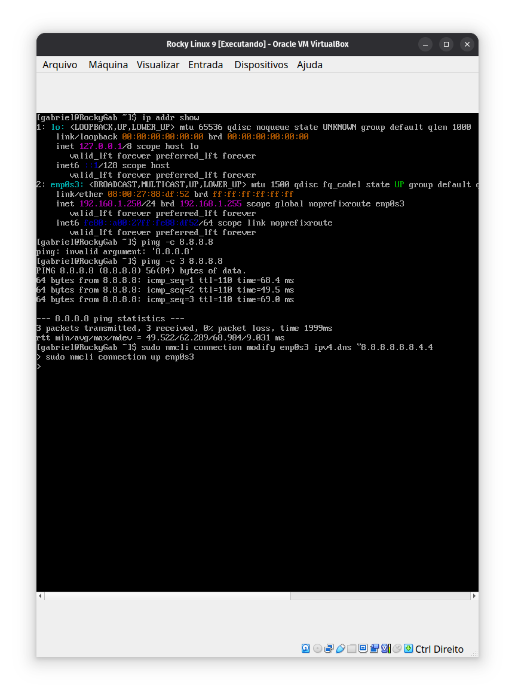

## 📊 Engenharia de Sistemas & Evidências

### 01. Case Study: Migração de Rede e Troubleshooting de DNS (Fortaleza Lab)
Após a migração física, implementei o endereçamento estático para consolidar a infraestrutura crítica.
* **Diagnóstico:** Conflito de sub-redes e cache de DHCP obsoleto em `/var/lib/NetworkManager/`.
* **Resolução:** Expurgue de leases antigos e injeção manual de DNS (8.8.8.8) via `nmcli`.
* **Impacto:** Restabelecimento da integração com GitHub e persistência de IP `192.168.1.250`.

| Falha Identificada (DNS Error) | Solução e Validação (Success) |
| :--- | :--- |
|  |  |

### 02. Segurança e Hardening: SSH Access
Identificação e correção do erro `Permission denied (publickey,password)`.
* **Fix:** Auditoria do `/etc/ssh/sshd_config` e ajuste de permissões de diretórios e chaves.

### 03. Workflow de Engenharia: Git Mastery
Domínio de versionamento para rastreabilidade de configurações de infraestrutura.

### 04. Performance e Estado do Sistema (Systemd)
Configuração para **Minimal Server Mode** (multi-user.target), reduzindo o overhead do sistema e a superfície de ataque.
* **Validação:** `systemctl get-default` -> `multi-user.target`.

---

## 🛡️ Terminal Survival Guide (Methodology)

Diretrizes que sigo para garantir a integridade de ambientes de produção:

* **Safety Net:** Uso de aliases (`rm -i`, `cp -i`, `mv -i`) para evitar destruição acidental de dados.
* **Vim Proficiency:** Edição ágil de configurações em servidores *headless* via CLI.
* **System Hygiene:** Monitoramento ativo de `/var/log` e limpeza de arquivos residuais de rede.

> **Nota de Portfólio:** Este repositório reflete uma mentalidade de "Infrastructure as Code" (IaC) e resiliência técnica, priorizando segurança e documentação rigorosa.
