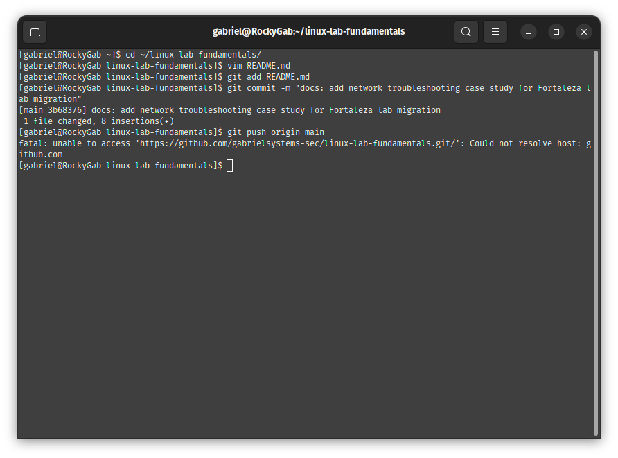
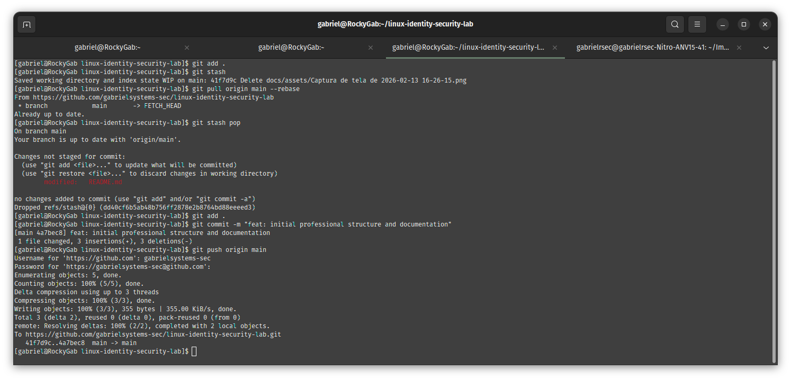
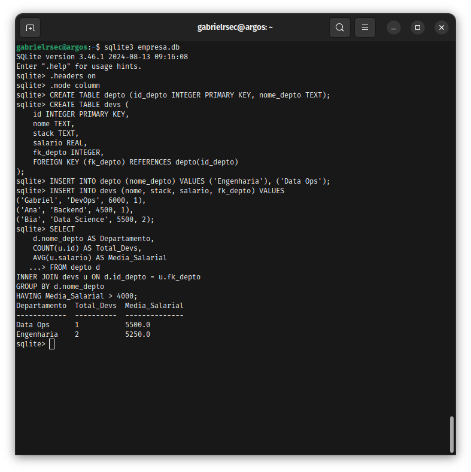

# Linux Foundations 🐧

> Provisão de infraestrutura base, automação de diagnóstico, rede e governança de código.

| Categoria | Tecnologias | Status |
| :--- | :--- | :--- |
| **Sistema Operacional** | Ubuntu Server / Rocky Linux | CLI-only |
| **Scripts** | Bash | Auditoria de saúde |
| **Rede** | IPv4 Estático / DNS | Validado |
| **Versionamento** | Git | Fluxos e troubleshooting |

---

## Objetivo

Este laboratório reúne fundamentos de administração Linux e operação de infraestrutura.

O foco está na configuração de ambientes minimalistas, diagnóstico de recursos e conectividade, automação em Bash e práticas de versionamento com Git.

---

## 1. Automação de Saúde

### Contexto do Problema

Servidores *headless* necessitam de mecanismos rápidos e leves para auditoria de recursos como CPU, memória e disco, sem depender de ferramentas externas pesadas.

### Troubleshooting e Resolução

Desenvolvimento do script `scripts/terminal_survival_kit.sh` em Bash puro para varredura de gargalos e geração de diagnóstico em tempo real.

<details>
  <summary>Ver evidência da auditoria de saúde</summary>


</details>

---

## 2. Persistência de Rede e DNS

### Contexto do Problema

Falha intermitente de resolução de nomes (DNS) e perda da rota padrão após reinicialização, impedindo o download de pacotes e atualizações críticas.

### Causa e Resolução

A causa identificada foi um conflito de concessão do DHCP dinâmico no ambiente virtualizado.

A solução aplicada foi a transição para endereçamento IPv4 estático persistente e configuração de DNS resiliente.

<details>
  <summary>Ver validação de rede</summary>

**Falha detectada (DNS Failure)**



**Configuração de IP estático**


**Validação de conectividade**


</details>

---

## 3. Governança e Troubleshooting com Git

### Contexto

Prática de fluxos de trabalho com Git, gestão do histórico de commits, restauração de arquivos e resolução de conflitos de merge.

O objetivo foi manter a integridade do código e compreender procedimentos de recuperação durante o desenvolvimento.

<details>
  <summary>Ver evidências da gestão com Git</summary>

**Gestão de commits**


**Fluxo de resolução**



</details>

---

## 4. Operação e Administração do Sistema

### Minimalismo Operacional

Otimização do consumo de RAM com desativação do subsistema gráfico X11 por meio do `multi-user.target` do Systemd.

### Hardening e Monitoramento

Migração da porta SSH padrão para redução de exposição a varreduras e utilização de ferramentas como `inxi` e `top` para inspeção do sistema.

<details>
  <summary>Ver hardening e administração do sistema</summary>

**Systemd Target CLI**


**Auditoria de hardware**


**Painel de infraestrutura**


**Persistência de dados**



</details>

---

## Estrutura

```text
.
├── scripts/
│   └── Automações de auditoria e diagnóstico
│
└── docs/
    └── assets/
        └── Evidências técnicas da operação e troubleshooting
