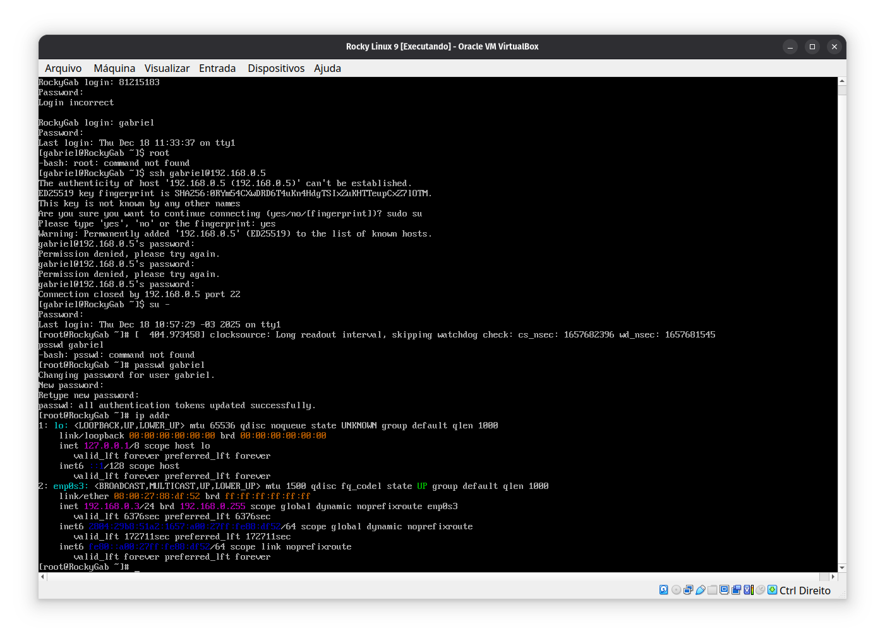
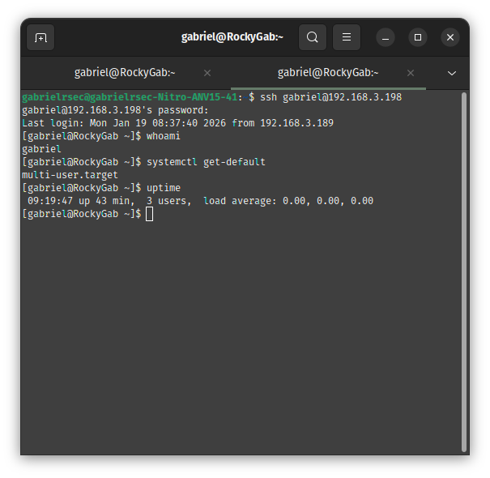
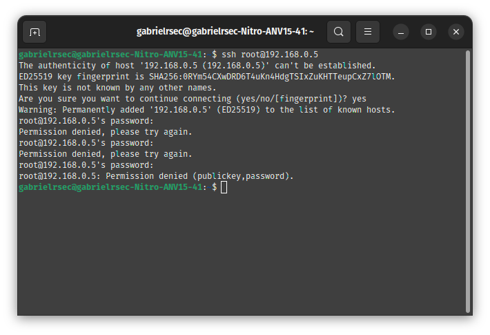
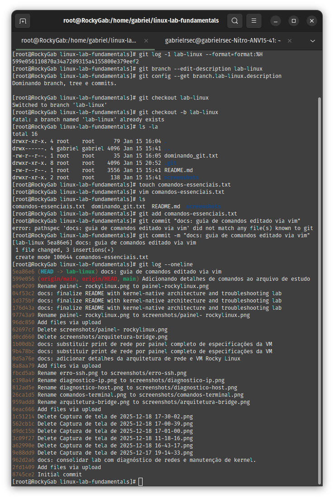

# Linux Infrastructure Laboratory: Rocky Linux & Ubuntu

## 🛠️ Tech Stack & Skills
* **Systems:** Linux (Ubuntu/Rocky), Systemd, User Management.
* **Networking:** SSH, TCP/IP, Bridge Networking.
* **Security:** Permissions (chmod/chown), SSH Hardening.
* **Tools:** Git, VirtualBox, CLI Mastery.

## 🏗️ Ambiente de Engenharia

### Host (Máquina Física)
* **OS:** Ubuntu 24.04 LTS (Kernel 6.14.0-36-generic)
* **Virtualização:** VirtualBox com aceleração KVM ativa.

### Guest (Enterprise Server)
* **OS:** Rocky Linux 9.7 (Minimal Install)
* **Recursos:** 3 vCPUs | 4GB RAM | 60GB Storage.
* **Rede:** Layer 2 Bridge Mode (Interface `wlp3s0`).

## 🛠️ Implementações e Troubleshooting

### 1. Otimização de Performance (Systemd)
Configuração do sistema para operar em modo **Minimal Server**.
* **Validação:** `systemctl get-default` -> `multi-user.target`.

### 2. Troubleshooting de Segurança: SSH Access
Identificação e correção do erro de `Permission denied (publickey,password)`.
* **Resolução:** Ajuste de permissões de usuário e validação do `/etc/ssh/sshd_config`.

### 3. Gestão de Versão (Git Mastery)
Workflow profissional de Git para rastreabilidade de configurações.

### 4. Troubleshooting de Rede: Migração Física (CE)
Resolução de conflitos de persistência de IP após migração do laboratório.
* **Diagnóstico:** Interface retendo registros de múltiplas sub-redes e cache de DHCP obsoleto.
* **Resolução:** Limpeza de leases em `/var/lib/NetworkManager/` e implementação de IP Estático via `nmcli`.
* **Validação:** Restabelecimento de conectividade SSH e atualização do mapeamento em `/etc/hosts`.

> **Nota de Portfólio:** Este incidente demonstrou a importância da gestão de persistência em redes móveis e consolidou o uso de endereçamento estático para servidores críticos.

---

## 📊 Evidências Técnicas

### 01. Arquitetura e Hipervisor

### 02. Conectividade de Rede (Bridge Mode)

### 03. Otimização do Estado do Servidor (SSH Access)

### 04. Troubleshooting de Segurança

### 05. Workflow de Engenharia (Git Log)

---
